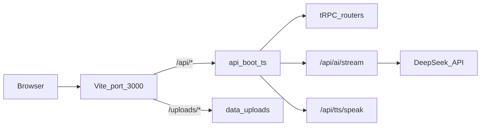

# 弈智 AI 学习成长系统

> 基于 DeepSeek 的自适应学习平台：自动判定学习类型，为每位学习者生成个性化大纲、每日内容与配图。

## 项目概览

弈智是一个全栈 AI 驱动的学习平台，通过 DeepSeek 大模型实现智能课程生成、流式授课、交互式答题和掌握度追踪。系统内置 **7 类学习引擎**，根据学习目标自动选择内容模板；支持万相 AI 插画与 Mermaid 图表混合配图、TTS 朗读、阅读模式与按天隔离的 AI 问答。

## 核心功能

| 模块 | 功能描述 |
|------|----------|
| **7 类学习引擎** | 自动判定抽象逻辑 / 操作逻辑 / 语言 / 网络关联 / 模型应用 / 感知表达 / 实践技艺，各有独立大纲与内容模板（`shared/typeEngine.ts`） |
| **Onboarding 引导** | 输入目标 → AI 类型判定 → 能力评估（L1–L5）→ 生成 N 天学习大纲 |
| **DeepSeek 流式授课** | SSE 实时生成 Markdown 学习内容，含公式（KaTeX）、代码、Mermaid 图表与 embedded quiz |
| **阅读模式** | 按 H2 章节卡片展示，支持目录、字号/行距调节、专注模式、阅读进度 |
| **智能配图** | 保存内容后异步生成 2–3 张/天：场景用阿里云万相；概念/流程图插入 ` ```mermaid ` 代码块由客户端渲染 |
| **TTS 朗读** | 火山引擎豆包语音，按句流水线播放当日学习内容 |
| **能力评估系统** | 5 级能力评测（L1–L5），影响内容生成难度 |
| **交互式答题** | 学习内容嵌入 `<!-- quiz -->` 选择题，答完即时反馈并计入掌握度 |
| **AI 问答辅导** | 按天隔离上下文，SSE 流式回答，结合当日全文 |
| **掌握度分析** | 四维加权算法实时计算知识点掌握程度 |
| **多计划管理** | 最多 7 个并行学习计划，支持切换 / 暂停 / 完成 |
| **学习历史** | 问答与答题记录回顾（History 页） |
| **用户数据隔离** | localStorage 按用户 ID 隔离，切换账户不串数据 |
| **浏览器通知** | Settings 中可选开启学习提醒（需用户授权） |

### 7 类学习引擎

| 类型 | 英文名 | 适用场景 |
|------|--------|----------|
| 抽象逻辑型 | `abstract_logic` | 数学、物理、统计等需推导的理论 |
| 操作逻辑型 | `operation_logic` | 编程、软件、命令行等动手操作 |
| 语言学习型 | `language` | 英语、日语等自然语言 |
| 网络关联型 | `network_assoc` | 历史、法律、政治等叙事因果 |
| 模型应用型 | `model_apply` | 金融、经济、管理等模型套用 |
| 感知表达型 | `perception` | 绘画、摄影、写作等审美创作 |
| 实践技艺型 | `practical` | 烹饪、驾驶、急救等操作流程 |

### Markdown 增强

- **Mermaid**：在代码块中使用 ` ```mermaid ` 标记，支持 flowchart、graph、sequenceDiagram 等，自动适配暗色主题
- **KaTeX**：行内 `$...$` 与块级 `$$...$$` 数学公式
- **配图意图标记**（内容生成时预埋）：`<!-- illustration: {"anchor":"...","intent":"...","medium":"wanxiang\|mermaid"} -->`

## 技术架构

### 开发态请求流



开发模式下，Vite 与 Hono 通过 `@hono/vite-dev-server` 一体运行：前端页面与 `/api/*`、`/uploads/*` 均走 **同一端口 3000**。

### 前端

| 技术 | 版本 | 用途 |
|------|------|------|
| React | 19.2 | UI 框架 |
| React Router | 7.6 | 路由 |
| TypeScript | 5.9 | 类型安全 |
| Vite | 7.2 | 构建与 dev server |
| Tailwind CSS + shadcn/ui | - | 样式与组件 |
| Framer Motion | 12.40 | 动画 |
| Three.js (@react-three/fiber) | 9.6 | 3D 背景 |
| React Markdown + KaTeX + Mermaid | - | 内容渲染 |
| TanStack Query + tRPC Client | 11.8 | 数据获取 |
| Zustand | 5.0 | 状态管理 |
| Recharts | 2.15 | 图表 |

### 后端

| 技术 | 版本 | 用途 |
|------|------|------|
| Hono | 4.8 | HTTP 框架 |
| tRPC Server | 11.8 | 类型安全 API |
| Drizzle ORM + MySQL2 | - | 数据库 |
| DeepSeek API | - | 文本生成（大纲、内容、评估、问答、配图 prompt） |
| 阿里云百炼万相 | - | 场景插画（可选） |
| 火山引擎 TTS | - | 语音朗读（可选） |
| qwen-vl | - | 配图视觉校验（可选，可关闭） |
| JWT (jose) | - | 身份认证 |

### 共享层

| 路径 | 用途 |
|------|------|
| `shared/typeEngine.ts` | 7 类学习类型判定与各阶段 prompt 模板 |
| `shared/markdownSections.ts` | Markdown H2 章节切分（前后端共用） |
| `contracts/` | 共享类型与错误码 |

## 数据库 Schema

### 核心表

- `users` / `verification_codes` — 手机号登录与验证码
- `learning_plans` — 学习计划（含 `learningType`、`currentDay`、状态）
- `learning_outline` — 每日大纲（标题、目标、关键词）
- `learning_contents` — 每日 Markdown 内容

### 学习追踪表

- `study_sessions` — 学习时长
- `quiz_results` — 答题记录（含 attempt 权重）
- `qa_history` — 问答历史（按 plan + day 隔离）
- `mastery_scores` — 掌握度评分

### 评估与任务

- `assessments` / `assessment_answers` — 能力评估
- `generation_tasks` — AI 生成任务状态

## 掌握度分析算法

四维加权模型（实现于 `api/services/masteryService.ts`）：

```
MasteryScore = min(100, round(
  StudyTimeScore   × 0.25 +   -- 学习时长 (25%)
  QAScore          × 0.20 +   -- 问答互动 (20%)
  QuizScore        × 0.40 +   -- 练习正确率 (40%)
  FrequencyScore   × 0.15     -- 学习频率 (15%)
))
```

| 维度 | 计算方式 |
|------|----------|
| 学习时长 | `studyMinutes / targetMinutes × 100`，上限 100 |
| 问答互动 | `questionsAsked × 20 + correctAnswers × 10`，上限 100 |
| 练习正确率 | 加权正确率（见下表），上限 100 |
| 学习频率 | `consecutiveDays × 14.3`，7 天连续 = 100 |

### 答题权重衰减

| 答题次数 | 权重 |
|----------|------|
| 第 1 次 | 1.0 |
| 第 2 次 | 0.7 |
| 第 3 次 | 0.5 |
| 第 4 次+ | 0.3 |

## 能力评估等级

| 等级 | 说明 |
|------|------|
| L1 | 零基础，从最基础概念讲起 |
| L2 | 入门，简要回顾基础 |
| L3 | 中级，进阶内容 + 实战 |
| L4 | 进阶，深入高级主题 |
| L5 | 高级，专家级内容 |

## 多计划管理

- 最多 **7 个** `active` 计划；`completed` 不计入上限
- 支持 `paused` 暂停与恢复
- localStorage 键名：`yizhi_learning_state_${userId}`，登出 / 切换用户时自动隔离

## 交互式答题格式

AI 生成内容时，练习题使用 HTML 注释嵌入：

```markdown
<!-- quiz
question: 以下哪个是 React 的核心特性？
A: 双向数据绑定
B: 虚拟 DOM
C: 依赖注入
D: 模板引擎
correct: B
explanation: React 使用虚拟 DOM 来提高渲染性能。
-->
```

前端 `QuizRenderer` 解析并渲染为交互卡片，结果写入 `quiz_results` 并触发掌握度重算。

## 智能配图管线

内容保存（`content.saveContent`）后，后台异步执行 `runIllustrationJob`：

```
Markdown 全文
  → 解析 <!-- illustration --> 标记（优先）或按 H2 分段
  → DeepSeek 提取 sceneBrief（主体、场景、uniqueIdentifiers）
  → 分流：wanxiang（场景插画）/ mermaid（概念流程图）
  → 万相 2K + thinking_mode；mermaid 经 sanitize 后以 ```mermaid 代码块插入正文
  → 可选 qwen-vl 视觉校验 + 一次 retry（仅万相）
  → 按 anchorText 插入 markdown
  → 万相图存储于 data/uploads/content-images/；Mermaid 由前端 MermaidDiagram 渲染
```

- 每日 **2–3 张**（万相 + 内嵌 Mermaid 合计），不配置 `DASHSCOPE_API_KEY` 时跳过万相，Mermaid 仍可插入

## 快速开始

### 环境要求

- Node.js 20+
- MySQL 8.0+
- DeepSeek API Key（必填）

### 安装与配置

```bash
npm install
cp .env.example .env   # Windows: copy .env.example .env
# 编辑 .env，至少填写 DATABASE_URL、DEEPSEEK_API_KEY、JWT_SECRET
npm run db:push        # 开发推荐；或 db:generate + db:migrate
npm run dev            # http://localhost:3000
```

> **注意**：开发必须运行 `npm run dev`，访问 **http://localhost:3000**（非 5173）。Vite 与 Hono API 在同一进程。

### 开发模式登录

手机号验证码在开发环境固定为 **123456**（见 `api/phone-auth-router.ts`）。

### 环境变量

| 分组 | 必填 | 说明 |
|------|------|------|
| `DATABASE_URL` | 是 | MySQL 连接串 |
| `DEEPSEEK_API_KEY` | 是 | 大纲、内容、评估、问答、配图 prompt |
| `DEEPSEEK_API_BASE` / `DEEPSEEK_MODEL` | 否 | 默认 `https://api.deepseek.com`、`deepseek-chat` |
| `JWT_SECRET` | 是 | JWT 签名 |
| `VOLCENGINE_TTS_*` | 否 | 未配置则 TTS 不可用 |
| `DASHSCOPE_API_KEY` | 否 | 未配置则跳过万相插画 |
| `DASHSCOPE_IMAGE_MODEL` | 否 | 默认 `wan2.7-image` |
| `DASHSCOPE_IMAGE_SIZE` | 否 | 默认 `2K` |
| `DASHSCOPE_VISION_MODEL` | 否 | 配图校验，默认 `qwen-vl-plus` |
| `IMAGE_VALIDATION_ENABLED` | 否 | 默认 `true`，设 `false` 可降 API 成本 |
| `MERMAID_RENDER_TIMEOUT_MS` | 否 | Mermaid 渲染超时，默认 30000 |

完整示例见 [`.env.example`](.env.example)。

### 生产部署

```bash
npm run build
npm start              # NODE_ENV=production，默认 PORT=3000
```

### 代码检查

```bash
npm run check          # TypeScript
npm run lint           # ESLint
npm run format         # Prettier
npm run test           # Vitest（api/**/*.test.ts）
```

## 页面路由

| 路径 | 页面 | 说明 |
|------|------|------|
| `/login` | Login | 手机号登录 |
| `/onboarding` | Onboarding | 新建计划（类型判定 + 评估 + 大纲） |
| `/` | Dashboard | 计划看板与进度 |
| `/study` | Study | 每日学习、问答、配图、TTS |
| `/mastery` | Mastery | 掌握度分析 |
| `/history` | History | 问答与答题历史 |
| `/settings` | Settings | 用户设置与通知 |

## 核心流程

### 1. 计划创建

```
用户输入学习目标（Onboarding）
  → detectLearningType（DeepSeek）
  → 能力评估 quiz
  → generateOutline → saveOutline
  → 跳转 Dashboard
```

### 2. 每日内容生成

```
Study 页点击生成
  → POST /api/ai/stream（DeepSeek SSE，typeEngine 系统 prompt）
  → 流式展示 Markdown
  → saveContent 写入 learning_contents
  → 后台 runIllustrationJob 生成配图
  → 前端轮询 getContent 刷新
```

### 3. 掌握度更新

```
学习 / 答题 / 提问
  → 写入 study_sessions / quiz_results / qa_history
  → computeMasteryScore 重算
  → 更新 mastery_scores
  → Dashboard / Mastery 展示
```

## 项目结构

```
.
├── api/
│   ├── boot.ts                 # Hono 入口：tRPC、/api/ai/stream、TTS、/uploads
│   ├── router.ts               # tRPC 路由聚合
│   ├── *-router.ts             # 业务路由（learning、content、qa、mastery…）
│   ├── services/
│   │   ├── aiService.ts        # DeepSeek 调用（大纲、流式内容、评估）
│   │   ├── contentImageService.ts  # 配图提取与生成
│   │   ├── qaService.ts        # 问答上下文与流式保存
│   │   └── masteryService.ts   # 掌握度算法
│   └── lib/
│       ├── deepseek.ts         # DeepSeek HTTP 客户端
│       ├── wanxiang-image.ts   # 万相文生图
│       ├── mermaid-sanitize.ts # Mermaid 语法修复与校验
│       ├── mermaid-render.ts   # 遗留 PNG 渲染（配图流程不再使用）
│       ├── volcengine-tts.ts   # TTS
│       └── env.ts              # 环境变量
├── shared/
│   ├── typeEngine.ts           # 7 类学习引擎与 prompt
│   └── markdownSections.ts     # H2 章节切分
├── db/
│   ├── schema.ts               # Drizzle schema
│   └── migrations/
├── src/
│   ├── pages/                  # Login, Onboarding, Dashboard, Study, …
│   ├── components/
│   │   ├── reading/            # 阅读模式（SectionCard、TOC、Toolbar）
│   │   ├── markdown/           # MarkdownRenderer、MermaidDiagram
│   │   ├── quiz/               # QuizRenderer、QuizCard
│   │   ├── layout/             # AppLayout
│   │   └── ui/                 # shadcn/ui 组件
│   ├── services/
│   │   ├── aiService.ts        # 客户端 fetch 封装（stream、tRPC 代理）
│   │   └── ttsService.ts
│   ├── stores/useLearningStore.ts
│   └── providers/trpc.tsx
├── data/uploads/               # 配图静态资源（gitignore）
├── contracts/
├── .env.example
├── vite.config.ts
└── README.md
```

## 响应式设计

- **桌面端（≥ 768px）**：Study 页左侧大纲 + 主内容区 + 可选 QA 面板
- **移动端（< 768px）**：底部大纲抽屉、紧凑顶栏、Tab 导航

## 安全特性

- JWT Bearer 认证（`/api/ai/stream` 等需登录）
- Drizzle ORM 参数化查询
- 敏感配置通过 `.env` 管理，勿提交密钥

## 常见问题

### Q: 生成内容报「Failed to fetch」或「无法连接服务器」？

确认已在项目目录运行 `npm run dev`，并访问 **http://localhost:3000**。若 dev 未启动，浏览器无法连接 `/api/ai/stream`。

### Q: 配图不显示？

1. 检查 `.env` 中 `DASHSCOPE_API_KEY` 是否配置（万相插画需要）
2. 保存内容后等待后台生成（约 1–3 分钟）
3. 抽象/操作类内容可能使用 Mermaid 图表，存于 `/uploads/content-diagrams/`

### Q: 如何降低配图 API 成本？

在 `.env` 设置 `IMAGE_VALIDATION_ENABLED=false`，关闭 qwen-vl 视觉校验；或使用 `DASHSCOPE_IMAGE_MODEL=wan2.7-image` 标准版。

### Q: TTS 不可用？

配置 `VOLCENGINE_TTS_API_KEY` 等变量，见 `.env.example`。

### Q: 如何更换 LLM？

修改服务端 [`api/lib/deepseek.ts`](api/lib/deepseek.ts) 与 [`api/services/aiService.ts`](api/services/aiService.ts)。客户端 [`src/services/aiService.ts`](src/services/aiService.ts) 仅负责 fetch 转发。

### Q: 如何重置本地学习状态？

删除 localStorage 中 `yizhi_learning_state_${userId}` 与 `yizhi_token`（需重新登录）。

## 开发规范

- 遵循 ESLint / Prettier 配置
- 提交前运行 `npm run check`
- TypeScript 严格模式，避免 `any`

## 贡献指南

1. Fork 本仓库
2. 创建特性分支（`git checkout -b feature/xxx`）
3. 提交更改并推送
4. 开启 Pull Request

## 许可证

MIT

---

**最后更新**：2026 年 6 月
