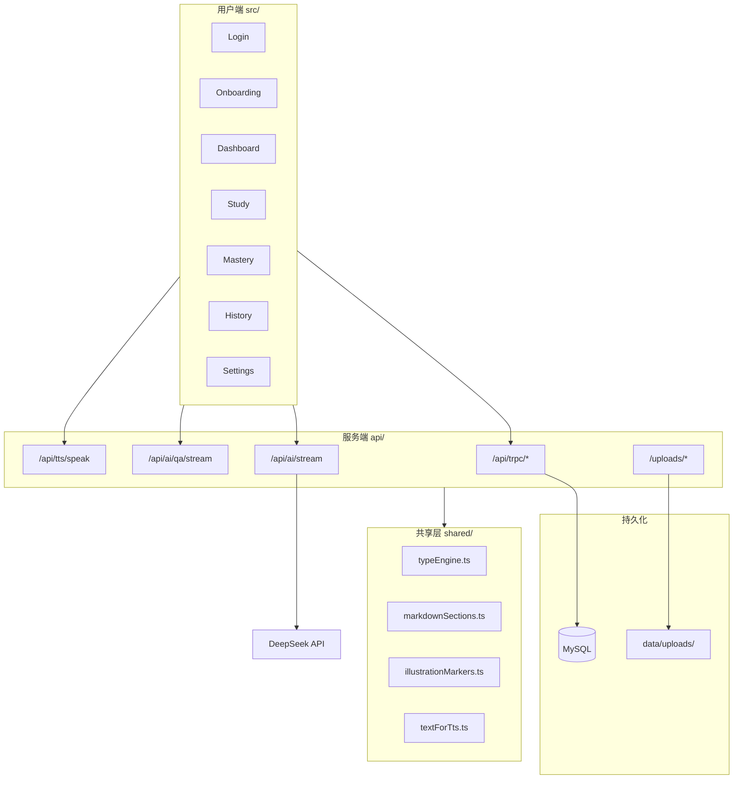
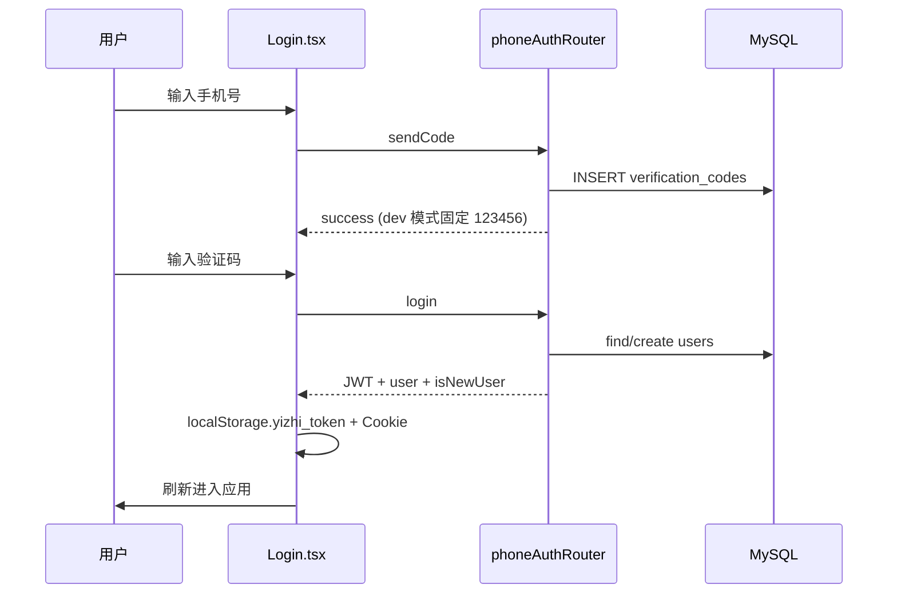
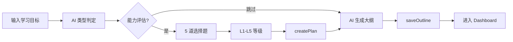
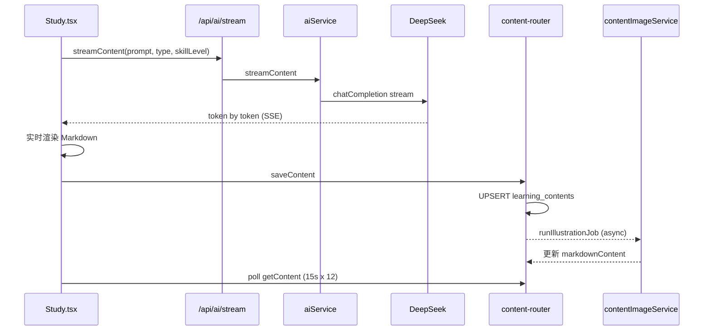
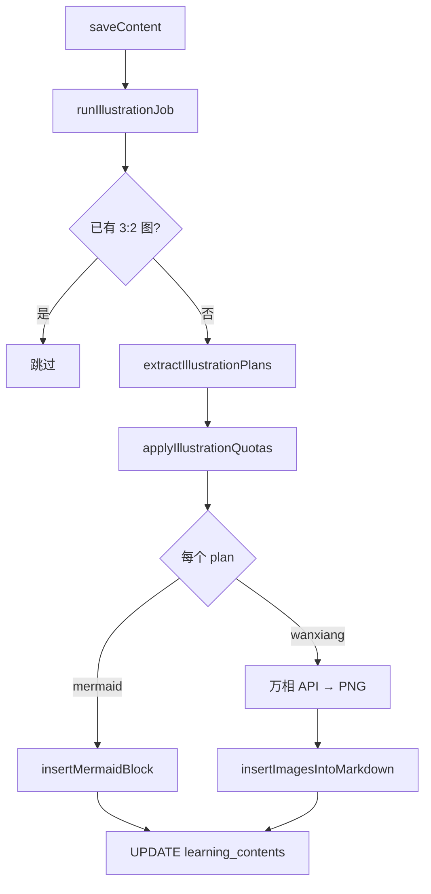
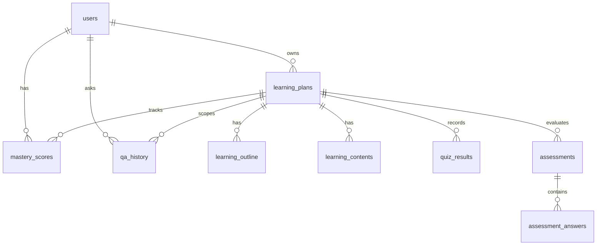

# 弈智项目 — 完整功能需求链路

本文档按用户旅程与系统模块，完整展示弈智（Yizhi）当前**已实现**的功能需求链路。面向开发、维护与二次扩展时快速定位代码入口。

---

## 一、产品定位与架构总览

**产品名**：弈智（Yizhi）

**定位**：基于 DeepSeek 的 AI 自适应学习平台，根据学习目标自动判定「7 类学习引擎」，生成个性化大纲、每日 Markdown 内容、配图、测验与掌握度分析。

**技术栈**：React 19 + Vite + tRPC + Hono + Drizzle/MySQL + DeepSeek +（可选）万相文生图 + 火山 TTS



**入口文件**：

- 前端路由：[`src/App.tsx`](../src/App.tsx)
- 后端启动：[`api/boot.ts`](../api/boot.ts)
- tRPC 聚合：[`api/router.ts`](../api/router.ts)
- 数据库：[`db/schema.ts`](../db/schema.ts)、[`db/relations.ts`](../db/relations.ts)

---

## 二、页面与路由地图

| 路径 | 页面 | 鉴权 | 核心职责 |
|------|------|------|----------|
| `/login` | [`Login.tsx`](../src/pages/Login.tsx) | 公开 | 手机号 + 验证码登录 |
| `/onboarding` | [`Onboarding.tsx`](../src/pages/Onboarding.tsx) | 需登录 | 新建学习计划向导 |
| `/` | [`Dashboard.tsx`](../src/pages/Dashboard.tsx) | 需登录 | 计划看板、切换/完成/删除 |
| `/study` | [`Study.tsx`](../src/pages/Study.tsx) | 需登录 | 每日学习主战场 |
| `/mastery` | [`Mastery.tsx`](../src/pages/Mastery.tsx) | 需登录 | 掌握度与统计 |
| `/history` | [`History.tsx`](../src/pages/History.tsx) | 需登录 | 问答历史回顾 |
| `/settings` | [`Settings.tsx`](../src/pages/Settings.tsx) | 需登录 | 个人设置、主题、通知 |
| `*` | [`NotFound.tsx`](../src/pages/NotFound.tsx) | 公开 | 404 |

**布局壳**：[`AppLayout.tsx`](../src/components/layout/AppLayout.tsx) — 侧边栏/底栏导航

**客户端状态**：[`useLearningStore.ts`](../src/stores/useLearningStore.ts) — 当前计划、天数、大纲等，按 `userId` 隔离存 `localStorage`

---

## 三、主链路 1：身份认证

**需求**：手机号 OTP 登录，无独立注册页（首次登录即创建用户）；JWT 维持会话；多用户数据隔离。



| 步骤 | 前端 | 后端 |
|------|------|------|
| 发码 | `trpc.phoneAuth.sendCode` | [`api/phone-auth-router.ts`](../api/phone-auth-router.ts) |
| 登录 | `trpc.phoneAuth.login` | 创建/查找用户 → [`api/lib/jwt.ts`](../api/lib/jwt.ts) 签发 token |
| 会话 | [`useAuth.ts`](../src/hooks/useAuth.ts) → `trpc.user.me` | [`api/context.ts`](../api/context.ts) + [`api/lib/request-auth.ts`](../api/lib/request-auth.ts) |
| 登出 | `trpc.auth.logout` + 清 localStorage | 清 Cookie |

**SSE/HTTP 流接口**（内容生成、问答、TTS）同样走 JWT 校验：[`api/boot.ts`](../api/boot.ts) 内 `getUserFromRequest`。

---

## 四、主链路 2：Onboarding — 创建学习计划

**需求**：用户输入学习目标 → AI 判定学习类型 → 可选 L1–L5 能力评估 → 生成 N 天大纲 → 入库并进入 Dashboard。



| 阶段 | 用户操作 | 前端调用 | 后端/AI | 数据写入 |
|------|----------|----------|---------|----------|
| 类型判定 | 提交目标 | `ai.detectLearningType` | [`aiService.detectLearningType`](../api/services/aiService.ts) + [`typeEngine.getTypeDetectionPrompt`](../shared/typeEngine.ts) | — |
| 能力评估 | 答 5 题或跳过 | `assessment.create/submitAnswer/complete` | [`assessment-router.ts`](../api/assessment-router.ts) | `assessments`, `assessment_answers` |
| 建计划 | 选天数 | `learning.createPlan` | [`learning-router.ts`](../api/learning-router.ts) | `learning_plans` |
| 生成大纲 | 自动 | `ai.generateOutline` | `getTypeOutlinePrompt` + DeepSeek | — |
| 存大纲 | 自动 | `learning.saveOutline` | bulk insert | `learning_outline` |
| 关联评估 | 自动 | `assessment.updatePlanId` | — | 更新 `assessments.planId` |

**约束**：

- 最多 **7 个** 并行 active 计划（Onboarding + Dashboard 校验）
- **7 类学习引擎**定义于 [`shared/typeEngine.ts`](../shared/typeEngine.ts)：`abstract_logic` / `operation_logic` / `language` / `network_assoc` / `model_apply` / `perception` / `practical`

**能力等级 L1–L5** 后续影响：大纲难度、每日内容 system prompt（`getTypeSystemPrompt`）。

---

## 五、主链路 3：计划管理（Dashboard）

**需求**：查看所有计划、切换当前计划、查看进度、完成/删除计划。

| 功能 | 前端 | API | 说明 |
|------|------|-----|------|
| 列表 | `trpc.learning.getPlans` | `learningRouter.getPlans` | 按 userId 查全部计划 |
| 切换 | `useLearningStore.restoreFromDB` + `getOutline` | — | 本地状态 + 拉大纲 |
| 完成 | `learning.completePlan` | status → `completed` | |
| 删除 | `learning.deletePlan` | 级联删 outline/content/quiz/mastery/qa/assessment | |
| 新建 | 跳转 `/onboarding` | — | |

**注意**：`learning.updateProgress`（同步 DB 的 `currentDay`）**已实现但前端未调用**；当前「当前第几天」主要由 `useLearningStore.currentDay` + localStorage 维护。

---

## 六、主链路 4：每日内容生成（Study 核心）

**需求**：选定计划与天数 → 若无内容则 SSE 流式生成 Markdown → 保存 DB → 触发异步配图。



| 环节 | 关键文件 |
|------|----------|
| 触发生成 | [`Study.tsx`](../src/pages/Study.tsx) `handleGenerateContent` |
| SSE 客户端 | [`src/services/aiService.ts`](../src/services/aiService.ts) `streamContent` |
| SSE 服务端 | [`api/boot.ts`](../api/boot.ts) POST `/api/ai/stream` → [`api/services/aiService.ts`](../api/services/aiService.ts) |
| Prompt | [`shared/typeEngine.ts`](../shared/typeEngine.ts) `getTypeSystemPrompt(learningType, skillLevel)` |
| 持久化 | [`api/content-router.ts`](../api/content-router.ts) `saveContent` → `learning_contents` |
| 状态查询 | `getContent`, `getContentStatuses`, `updateStatus` |

**生成内容结构**（AI prompt 约定）：

1. 标准 Markdown（H2 章节、KaTeX、代码块）
2. **嵌入式测验**：`<!-- quiz: {...} -->` HTML 注释
3. **配图意图标记**：`<!-- illustration: {"anchor","intent","medium"} -->`（配图完成后会被 strip）
4. AI 也可直接输出 ` ```mermaid ` 代码块

**输入上下文**：当日 outline（title/goal/keywords）+ 计划 `learningType` + 评估 `skillLevel`（`assessment.getByPlan`）。

---

## 七、主链路 5：智能配图

**需求**：`saveContent` 后自动、仅首次配图；每天最多 2–3 张；场景用万相 PNG，概念/流程用 Mermaid 内联；图片存本地磁盘，不提交 Git。



| 环节 | 文件 |
|------|------|
| 编排 | [`api/content-router.ts`](../api/content-router.ts) `runIllustrationJob` |
| 核心逻辑 | [`api/services/contentImageService.ts`](../api/services/contentImageService.ts) `generateContentIllustrations` |
| 锚点解析 | [`shared/illustrationMarkers.ts`](../shared/illustrationMarkers.ts)、[`shared/markdownSections.ts`](../shared/markdownSections.ts) |
| 配额/媒介 | [`shared/typeEngine.ts`](../shared/typeEngine.ts) `applyIllustrationQuotas`, `getImageMediumForSection` |
| 万相 | [`api/lib/wanxiang-image.ts`](../api/lib/wanxiang-image.ts) |
| 可选校验 | [`api/lib/image-validation.ts`](../api/lib/image-validation.ts) (qwen-vl) |
| Mermaid 清洗 | [`api/lib/mermaid-sanitize.ts`](../api/lib/mermaid-sanitize.ts) |
| 存储路径 | `data/uploads/content-images/{planId}/{dayNumber}/{n}.png` |
| 静态访问 | [`api/boot.ts`](../api/boot.ts) `/uploads/*` |
| 前端渲染 | [`MarkdownRenderer.tsx`](../src/components/markdown/MarkdownRenderer.tsx) + [`MermaidDiagram.tsx`](../src/components/markdown/MermaidDiagram.tsx) |
| 标记清理 | 后端 job 完成后 + 前端渲染时 `stripIllustrationMarkers` |

**客户端等待配图**：Study 在 `saveContent` 成功后每 15 秒轮询 `getContent`，最多 12 次。

**已移除**：「重新配图」按钮与 `generateIllustrations` tRPC（仅首次自动配图）。

---

## 八、主链路 6：阅读体验（Study UI）

**需求**：H2 章节卡片、目录、字号/行距/专注模式、滚动进度、30 分钟休息提醒、移动端 Mermaid 滚动稳定。

| 组件 | 职责 |
|------|------|
| [`ReadingShell.tsx`](../src/components/reading/ReadingShell.tsx) | 阅读容器、进度条 ref |
| [`ReadingMarkdown.tsx`](../src/components/reading/ReadingMarkdown.tsx) | 按 H2 切分 → SectionCard |
| [`ReadingToc.tsx`](../src/components/reading/ReadingToc.tsx) | 目录，IntersectionObserver 高亮 |
| [`ReadingToolbar.tsx`](../src/components/reading/ReadingToolbar.tsx) | 字号、行距、专注模式 |
| [`QuizRenderer.tsx`](../src/components/quiz/QuizRenderer.tsx) | 解析 quiz 注释块 |
| [`MarkdownRenderer.tsx`](../src/components/markdown/MarkdownRenderer.tsx) | KaTeX + Mermaid + 图片 |

**天数切换**：`goToDay(day)` → 更新 store → 拉 `getContent` + `qa.getHistory`（不自动写 DB `currentDay`）。

---

## 九、主链路 7：AI 问答辅导

**需求**：基于**当日全文**的流式问答；按 plan + day 隔离上下文；回答写入历史并计入掌握度。

```
Study.handleAskQuestion
  → fetch POST /api/ai/qa/stream
    → qaService.prepareQARequest (无内容则 412)
    → aiService.streamQAWithContext
    → pipeQAStreamWithSave → qa_history + recordQAMastery
```

| 模块 | 文件 |
|------|------|
| 前端 | [`Study.tsx`](../src/pages/Study.tsx)、[`aiService.streamQA`](../src/services/aiService.ts) |
| 后端 | [`api/services/qaService.ts`](../api/services/qaService.ts)、[`api/qa-router.ts`](../api/qa-router.ts) |
| 历史页 | [`History.tsx`](../src/pages/History.tsx) → `qa.getHistory` |

---

## 十、主链路 8：TTS 朗读

**需求**：将当日 Markdown 转为纯文本，按句调用火山 TTS 流水线播放。

| 环节 | 文件 |
|------|------|
| 文本预处理 | [`shared/textForTts.ts`](../shared/textForTts.ts)（去 quiz/代码/公式） |
| 前端播放 | [`ttsService.ts`](../src/services/ttsService.ts)、TtsButton 组件 |
| 后端 | [`api/boot.ts`](../api/boot.ts) POST `/api/tts/speak` → [`api/lib/volcengine-tts.ts`](../api/lib/volcengine-tts.ts) |

---

## 十一、主链路 9：测验与掌握度

### 11.1 两套「测验」体系

| 类型 | 时机 | 存储 | API |
|------|------|------|-----|
| **能力评估** | Onboarding | `assessments` + `assessment_answers` | `assessment.*` |
| **嵌入式每日 quiz** | 学习内容内 | `quiz_results` | `mastery.submitQuiz` |

### 11.2 嵌入式 Quiz 流程

```
AI 生成 <!-- quiz -->
  → QuizRenderer 解析展示
  → 用户提交 → trpc.mastery.submitQuiz
  → INSERT quiz_results (attemptNumber++)
  → computeQuizScore → UPDATE mastery_scores
```

### 11.3 掌握度四维算法

[`api/services/masteryService.ts`](../api/services/masteryService.ts)：

```
MasteryScore = min(100, round(
  StudyTimeScore × 0.25 +
  QAScore × 0.20 +
  QuizScore × 0.40 +
  FrequencyScore × 0.15
))
```

| 输入来源 | API | 触发时机 |
|----------|-----|----------|
| 学习时长 | `mastery.recordStudy` | Study 页卸载时 |
| 问答次数 | `recordQAMastery` | QA 流结束 |
| 答题 | `mastery.submitQuiz` | Quiz 提交 |
| 展示 | `mastery.getScores`, `getStats` | Mastery 页 |

Quiz 多次作答权重：第 1 次 1.0，第 2 次 0.7，第 3 次 0.5，之后 0.3。

---

## 十二、主链路 10：设置与个人资料

[`Settings.tsx`](../src/pages/Settings.tsx)：

- `user.updateProfile` — 修改昵称
- 主题切换（本地）
- 浏览器通知授权（学习提醒）
- 登出

---

## 十三、数据库实体关系



**13 张表**（[`db/schema.ts`](../db/schema.ts)）：`users`, `verification_codes`, `learning_plans`, `learning_outline`, `learning_contents`, `mastery_scores`, `qa_history`, `generation_tasks`, `study_sessions`, `quiz_results`, `assessments`, `assessment_answers`

---

## 十四、tRPC API 全景

| Router | 主要 Procedures | 前端是否使用 |
|--------|-----------------|--------------|
| `ping` | health check | 否 |
| `phoneAuth` | sendCode, login | Login |
| `auth` | me, logout | useAuth |
| `user` | me, updateProfile | Settings |
| `ai` | detectLearningType, generateOutline, generateAssessmentQuestions, ask | Onboarding |
| `learning` | createPlan, getPlans, getPlan, saveOutline, getOutline, completePlan, deletePlan, **updateProgress** | 除 updateProgress 外均用 |
| `content` | getContent, saveContent, getContentStatuses, updateStatus | Study |
| `qa` | askAndAnswer, ask, saveAnswer, getHistory, getRecentQuestions | Study, History |
| `mastery` | recordStudy, recordQA, submitQuiz, getScores, getStats | Study, Mastery |
| `assessment` | create, getQuestions, submitAnswer, complete, getResult, getByPlan, updatePlanId | Onboarding, Study |
| `generation` | createTask, updateTask, getTask, getLatestTask, getTaskHistory | **未使用** |

**非 tRPC HTTP**：

- `POST /api/ai/stream` — 内容 SSE
- `POST /api/ai/qa/stream` — 问答 SSE
- `POST /api/tts/speak` — TTS
- `GET /uploads/*` — 配图静态文件

---

## 十五、端到端用户旅程（一条完整链路）

```mermaid
flowchart TB
  A[打开 /login] --> B[手机号验证码登录]
  B --> C{有活跃计划?}
  C -->|否| D[/onboarding]
  D --> E[AI 判类型 + 评估 + 生成大纲]
  E --> F[/ Dashboard]
  C -->|是| F
  F --> G[选择计划 → /study]
  G --> H{当日有内容?}
  H -->|否| I[SSE 流式生成内容]
  I --> J[saveContent]
  J --> K[后台异步配图]
  H -->|是| L[阅读模式]
  K --> L
  L --> M[答题 / 问答 / TTS]
  M --> N[recordStudy + mastery 更新]
  N --> O[/mastery 查看掌握度]
  L --> P[/history 回顾问答]
```

---

## 十六、已知设计缺口（已实现 API、未接 UI）

1. **`learning.updateProgress`** — DB `currentDay` 不同步，仅靠 localStorage
2. **`generation-router`** — 生成任务追踪表存在，前端无消费
3. **`study_sessions` 表** — schema 有，主要逻辑走 `mastery.recordStudy`
4. **配图** — 新部署/clone 后本地 PNG 不存在，需重新生成或备份 `data/uploads/`
5. **无传统管理端** — 运营换图/改内容不走 CMS，内容全由 AI 管线驱动

---

## 十七、关键共享模块职责

| 模块 | 职责 |
|------|------|
| [`shared/typeEngine.ts`](../shared/typeEngine.ts) | 7 类引擎定义；类型判定/大纲/内容/评估/配图各阶段 prompt；配图配额 |
| [`shared/markdownSections.ts`](../shared/markdownSections.ts) | H2 切分、TOC、锚点定位 |
| [`shared/illustrationMarkers.ts`](../shared/illustrationMarkers.ts) | illustration 注释解析与清理 |
| [`shared/textForTts.ts`](../shared/textForTts.ts) | Markdown → 朗读文本 |
| [`contracts/`](../contracts/) | 共享常量、错误码 |

---

## 附录：7 类学习引擎速查

| 类型 | 英文名 | 适用场景 |
|------|--------|----------|
| 抽象逻辑型 | `abstract_logic` | 数学、物理、统计等需推导的理论 |
| 操作逻辑型 | `operation_logic` | 编程、软件、命令行等动手操作 |
| 语言学习型 | `language` | 英语、日语等自然语言 |
| 网络关联型 | `network_assoc` | 历史、法律、政治等叙事因果 |
| 模型应用型 | `model_apply` | 金融、经济、管理等模型套用 |
| 感知表达型 | `perception` | 绘画、摄影、写作等审美创作 |
| 实践技艺型 | `practical` | 烹饪、驾驶、急救等操作流程 |
